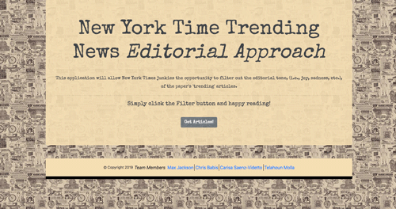

# New York Time Trending News Editorial Approach
This app grabs articles from the New York Times using their API and sends the text through the IBM Watson tone analyzer API to get the overall tone of the article. Our original idea was to be able to have the user filter articles based on their tone and have the news they want.

### Interface

Instructions:
* Click on the "Get Aritcles" button to grab articles from The New York Times

Click on the link to try it out!
https://fizzymo.github.io/Number-1-Team/

### Built with
* NYT API
* Watson IBM API
* Google Firebase
* HTML5
* CSS3
* JavaScript
* Bootstrap
* jQuery

Here's a preview of the app:

permalink: /index.html
